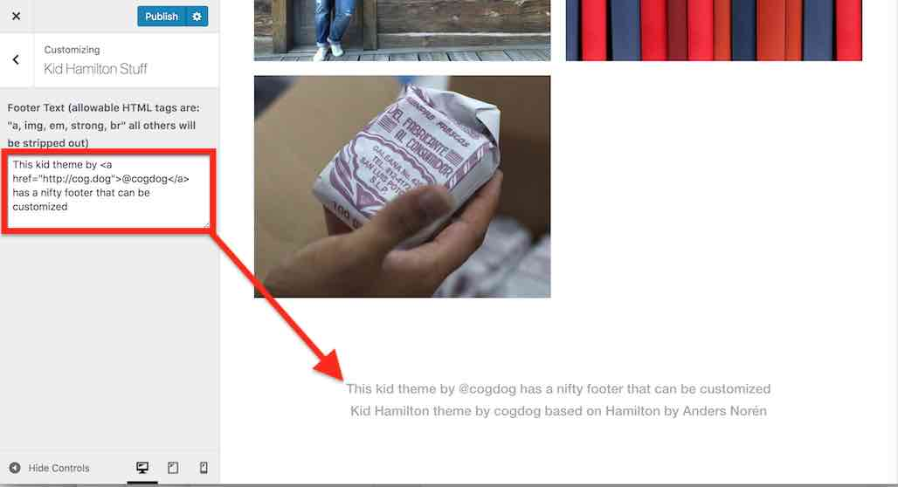

# Kid Hamilton WordPress Theme
by Alan Levine http://cog.dog/ or http://cogdogblog.com/ 

A Wordpress child theme of Anders Nor&eacute;n's [Hamilton](https://wordpress.org/themes/hamilton/) with few small mods.

-----
*If this kind of stuff has any value to you, please consider supporting me so I can do more!*

 

----- 

Actually it's a small mod now, maybe more to come... I have a WordPress customizer add on that enables you to create your own footer text to replace the standard copyright one (but we still give Anders Nor&eacute;n credit below). For example, you might use it to insert a creative commons license statement.

## Installing

First, use the standard WordPress Appearances -> Themes to find and install the [Hamilton theme](https://wordpress.org/themes/hamilton/).

Next, install the Kid Hitchock theme [downloaded from this repo as a .zip file](https://github.com/cogdog/kid-hamilton/archive/master.zip); either by uploading to your wp-content/themes directory or by direct FTPing the unzipped files to your wordpress `wp-content/themes`  directory.

Then activate the theme! Build content! Go to the Customizer to kid around with your footer.

## Seen the Kid?

* [Alan Levine's November 2017 Visit Down Under](http://cog.dog/roo/)
* [I am no artist but I make a few digital artefacts](https://marianafun.es/art/)

